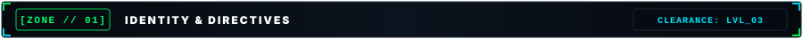
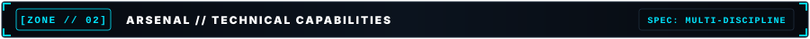
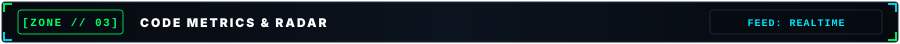

  

&nbsp;

&nbsp;

&nbsp;

&nbsp;

&nbsp;

&nbsp;

 

<!-- ==================== ABOUT: IDENTITY & DIRECTIVES ==================== -->

> #### `// OPERATOR STATEMENT :: CORE PROFILE`
> **Passionate technology enthusiast focused on cybersecurity, front-end development, and building innovative digital solutions.**  
> *Interested in secure systems, AI-driven applications, and modern technologies, with a strong focus on continuous learning and problem-solving.*

 

| DIRECTIVE | OPERATIONAL FOCUS | DIRECTIVE | OPERATIONAL FOCUS |
| :---: | :--- | :---: | :--- |
|  | 🚀 **Exploring Cybersecurity & Emerging Tech** |  | 💻 **Building modern & user-focused apps** |
|  | 🤖 **Learning RAG & Vector Databases** |  | 🔐 **Expanding cybersecurity & security ops** |
|  | 📚 **Pursuing ISC2 Certified in Cybersecurity** |  | 🌱 **Constantly learning new tech & practices** |

   
  

 

<!-- ==================== SKILLS: TECHNICAL CAPABILITIES ==================== -->

  

  

 

<table align="center">
  <thead>
    <tr>
      <th align="left">CATEGORY</th>
      <th align="left">TECHNOLOGIES &amp; TOOLS</th>
    </tr>
  </thead>
  <tbody>
    <tr>
      <td align="left" nowrap="nowrap">💻 <b>Programming Languages</b></td>
      <td align="left">
        
        
        
        
        
        
      </td>
    </tr>
    <tr>
      <td align="left" nowrap="nowrap">🌐 <b>Frameworks &amp; Web</b></td>
      <td align="left">
        
        
        
      </td>
    </tr>
    <tr>
      <td align="left" nowrap="nowrap">🗄️ <b>Databases &amp; Cloud</b></td>
      <td align="left">
        
        
        
        
      </td>
    </tr>
    <tr>
      <td align="left" nowrap="nowrap">🤖 <b>AI &amp; Machine Learning</b></td>
      <td align="left">
        
        
        
        
        
        
      </td>
    </tr>
    <tr>
      <td align="left" nowrap="nowrap">🛠️ <b>Tools &amp; Platforms</b></td>
      <td align="left">
        
        
        
        
        
        
      </td>
    </tr>
  </tbody>
</table>

 

<!-- ==================== STATS: CODE METRICS & RADAR ==================== -->

  

&nbsp;

  

  

 

<!-- ==================== CONTACT: TRANSMISSIONS ==================== -->

  

  

<table align="center">
  <thead>
    <tr>
      <th align="left">COMMAND</th>
      <th align="left">RELAY ACTION</th>
    </tr>
  </thead>
  <tbody>
    <tr>
      <td align="left">
        <a href="https://linkedin.com/in/prem-2k26"><code>$ connect --target linkedin</code></a> 
        ↳ Operator Identity &amp; Professional Network Relay
      </td>
      <td align="left">
        
      </td>
    </tr>
    <tr>
      <td align="left">
        <a href="https://github.com/XiaoSane"><code>$ fetch --node xiaosane</code></a> 
        ↳ Codebase Repositories &amp; Security Tooling
      </td>
      <td align="left">
        
      </td>
    </tr>
  </tbody>
</table>

  

  
  &nbsp;&nbsp;
  
  &nbsp;&nbsp;
  

 

  
  &nbsp;&nbsp;
  
  &nbsp;&nbsp;
  

  

  
  &nbsp;&nbsp;
  

  Designed &amp; Maintained by <b>Prem Patil</b> (@XiaoSane) • Built for Defensive Cybersecurity &amp; AI Systems

